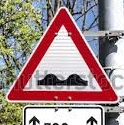

# **Traffic Sign Recognition** 

## Writeup

---

**Build a Traffic Sign Recognition Project**

The goals / steps of this project are the following:
* Load the data set (see below for links to the project data set)
* Explore, summarize and visualize the data set
* Design, train and test a model architecture
* Use the model to make predictions on new images
* Analyze the softmax probabilities of the new images
* Summarize the results with a written report

[//]: # (Image References)

[barplot1]: ./examples/barplot_pct_of_cls_in_dataset.png "Visualization"
[image2]: ./examples/grayscale.jpg "Grayscaling"
[image3]: ./examples/random_noise.jpg "Random Noise"
[image4]: ./downloaded_imgs/bicycle_laws.jpg "."
[image6]: ./downloaded_imgs/bumpy.jpg "."
[image7]: ./downloaded_imgs/caution_roadworks.jpg "."
[image8]: ./downloaded_imgs/inverted_triangle_empty.jpg "."
[image9]: ./downloaded_imgs/kindergarten.jpg "."
[image10]: ./downloaded_imgs/warning_frequent_accdidents.jpg "."
[image11]: ./downloaded_imgs/three_cars.jpg "."

## Rubric Points
### Here I will consider the [rubric points](https://review.udacity.com/#!/rubrics/481/view) individually and describe how I addressed each point in my implementation.  

---
### Writeup / README

#### 1. Provide a Writeup / README that includes all the rubric points and how you addressed each one. You can submit your writeup as markdown or pdf. You can use this template as a guide for writing the report. The submission includes the project code.

You're reading it! and here is a link to my [project code](https://github.com/cuckookernel/CarND-Traffic-Signs)

### Data Set Summary & Exploration

#### 1. Provide a basic summary of the data set. 

I used the numpy library to calculate summary statistics of the traffic
signs data set:

* The size of training set is 34799
* The size of the validation set is 4410
* The size of test set is 12630
* The shape of a traffic sign image is 32 by 32
* The number of unique classes/labels in the data set is 43

#### 2. Include an exploratory visualization of the dataset.

Here is an exploratory visualization of the data set. It is a bar chart showing how the train, validation and test datasets are distributed amond the different classes. Each bar represents a percentage of the corresponding dataset.

![alt text][barplot1]

### Design and Test a Model Architecture

#### 1. Describe how you preprocessed the image data. What techniques were chosen and why did you choose these techniques? Consider including images showing the output of each preprocessing technique. Pre-processing refers to techniques such as converting to grayscale, normalization, etc. (OPTIONAL: As described in the "Stand Out Suggestions" part of the rubric, if you generated additional data for training, describe why you decided to generate additional data, how you generated the data, and provide example images of the additional data. Then describe the characteristics of the augmented training set like number of images in the set, number of images for each class, etc.)

As a preprocessing step, I attempted generating a 32 x 32 x 6 volume for each image via the function `preproc_ls_1` in file `helpers.py`. This function does the following: 
  
  - converts raw image to HLS space
  - picks L (lightness) and S (saturation) components
  - applies Canny Edge detection to (S) to yield a binary 32 x 32 E
  - Assembles 32 x 32 x 6 volumee by stacking R, G, B channels from raw image, together with L, S and the E

As a last step, I applied normalization separately to each of the 6 channels. 

However, all this  tourned out not to help very much :( 
The final architecture simply works on a normalized version of the original 32 x 32 x 3 RGB image, where the normalization 
is applied accross all three channels together.

#### 2. Describe what your final model architecture looks like including model type, layers, layer sizes, connectivity, etc.) Consider including a diagram and/or table describing the final model.

My final was architecture   `arch_3_3_b` which is fully specified in file `architectures.py` and 
consisted of the following layers:

| Layer         		  |     Description	        					        | 
|:-----------------------:|:---------------------------------------------------:| 
| Input         	      | 32x32x3 RGB image   				     			| 
| Convolution 3x3 + RELU  | 1x1 stride, valid padding, outputs 30 x 30 x 32 	|
| Max pooling	      	  | 2x2 stride,  outputs 15x15x32 			            |
| Convolution 3x3 + RELU  | 1x1 stride, valid padding, outputs 13 x 13 x  32    |
| Max pooling	      	  | 2x2 stride,  outputs 7 x 7 x 32				        |
| Convolution 5x5 + RELU  | 1 x 1 stride, valid padding, outputs  3 x 3 x 16    |   
| Flatten 	          	  | outputs vector of dimension 144                     | 
| Fully connected + RELU  | outputs vector of dimension 120        		        |
| Dropout                 | keep-prob taken from "keep_prob" variable           |
| Fully connected + RELU  | outputs vector of dimension   83      		        |
| Dropout                 | keep-prob taken from "keep_prob" variable           |
| Fully connected         | outputs vector of dimension   43     		        |
| Softmax				  | outputs vector of probabilitites of dimension 43	|

#### 3. Describe how you trained your model. The discussion can include the type of optimizer, the batch size, number of epochs and any hyperparameters such as learning rate.

To train the model, I used an AdamOptimizer with a learning rate of 0.0005 and default values for $\beta_1$ and $\beta_2$. 
I trained for 200 epochs with a batchsize of 128 and dropout keep-probability of 0.6. 

#### 4. Describe the approach taken for finding a solution and getting the validation set accuracy to be at least 0.93. Include in the discussion the results on the training, validation and test sets and where in the code these were calculated. Your approach may have been an iterative process, in which case, outline the steps you took to get to the final solution and why you chose those steps. Perhaps your solution involved an already well known implementation or architecture. In this case, discuss why you think the architecture is suitable for the current problem.

PENDING

My final model results were:
* training set accuracy of 99.99%
* validation set accuracy of 96.35%
* test set accuracy of 94.55%

If an iterative approach was chosen:
* What was the first architecture that was tried and why was it chosen?

The first architecture that I tried was pretty much identical to LeNet-5 with the following minor changes. 
The first layer was allowed to be a volume of depth 3, for the RGB channels. Instead of tanh-style activation functions
I used ReLUs, and there was no Gaussian Layer. 

* What were some problems with the initial architecture?

The main problem with this architecture was that it didn't achieve good accuracy on the validation set. It roughly reached 91%.

* How was the architecture adjusted and why was it adjusted? Typical adjustments could include choosing a different model architecture, adding or taking away layers (pooling, dropout, convolution, etc), using an activation function or changing the activation function. One common justification for adjusting an architecture would be due to overfitting or underfitting. A high accuracy on the training set but low accuracy on the validation set indicates over fitting; a low accuracy on both sets indicates under fitting.

After trying the Lenet-5 architecture the first thing I did was to add another 3x3 convolutional layer at the beginning while at the same time changing the old first layer to 3x3 convolution. Then I fiddled a bit with the number of filters in these first layers, 
until better training and validation accuracies were produced. The last big change was to add dropout to the last two fully-connected layers, this helped a lot in reducing overfitting. 

* Which parameters were tuned? How were they adjusted and why?

I performed a grid search over $36=3×2×2×3$ combinations for hyperparameters netw_arch_name, learning_rate, batch_size and keep_prob. Then, when it was apparent that  `arch_3_3_b` tended to perform better than the other ones, I further tried four more combinations of  batch_size and keep_prob for just that architecture, for a total of 40 hyper-param combinations.

* What are some of the important design choices and why were they chosen? For example, why might a convolution layer work well with this problem? How might a dropout layer help with creating a successful model?

Of course, using convolutional layers are crucial for this type of problem as we are trying to `understand` images, which have very high dimensionality (number of pixels x channels) and further, pixels that are close together show light coming from the same real object / surface and are hence correlated. Convolutions help reduce the number of parameters of the initial layers greatly and represent the physical notion of closeness in the network. The dropout layer definitely helped in creating a model with controlled overfitting by forcing some redundancy on the network and hence diminishing the degrees of freedom in parameters, and helping to avoid the complete memorization of the the training set completely.  

Another important design choice for me was to add smaller convolutions but greater depth of them, this helped the network perform well 
with fewer parameters.

If a well known architecture was chosen...
It wasn't my case. The architecture was completely tailormade.

* How does the final model's accuracy on the training, validation and test set provide evidence that the model is working well?

Well, the test accuracy was 94.55% which is decent, considered that the test set was never used for either training or hyperparameter tuning. The validation accuracy pretty high also, indicating that although there is some overfit, it is not disproportionate. 

### Test a Model on New Images

#### 1. Choose five German traffic signs found on the web and provide them in the report. For each image, discuss what quality or qualities might be difficult to classify.

Here are seven German traffic signs that I found on the web:

![alt text][image4] ![alt text][image6] ![alt text][image7] 
![alt text][image8] ![alt text][image9] ![alt text][image10]
![alt text][image11]

Out of these only the third one might be difficult to classify because of the leave shadows and 
also last one might of the unusual perspective.

#### 2. Discuss the model's predictions on these new traffic signs and compare the results to predicting on the test set. At a minimum, discuss what the predictions were, the accuracy on these new predictions, and compare the accuracy to the accuracy on the test set (OPTIONAL: Discuss the results in more detail as described in the "Stand Out Suggestions" part of the rubric).

Here are the results of the prediction:

| Image			        |     Prediction	        					| 
|:---------------------:|:---------------------------------------------:| 
| Right-of-way     		| Right-of-wayign   							| 
| Children crossing     | Children crossing								|
| Yield					| Yield											|
| Bumpy Road            | Bumpy Road					 				|
| General Caution		| General Caution      							|
| Three cars in row		| Speed limit 30                                |

The model was able to correctly guess 6 of the 5 traffic signs, which gives an accuracy of 86%. This compares favorably to the accuracy on the test set of 94%

#### 3. Describe how certain the model is when predicting on each of the five new images by looking at the softmax probabilities for each prediction. Provide the top 5 softmax probabilities for each image along with the sign type of each probability. (OPTIONAL: as described in the "Stand Out Suggestions" part of the rubric, visualizations can also be provided such as bar charts)

The code for making predictions and getting the top 5 indices and probability values on my final model
is located in the 18th cell of the Ipython notebook.

<table>
<tr><th>Image</th>
<th> &nbsp; </th> </tr> 
<tr>
<th> </th>
<td><table><tr> <th>Signal</th> <th>Probability</th> </tr>
<tr><td>Right-of-way at the next intersection</td> <td>1</td></tr>
<tr><td>Beware of ice/snow</td> <td>1.10489e-16</td></tr>
<tr><td>Children crossing</td> <td>2.26836e-17</td></tr>
<tr><td>Double curve</td> <td>4.8346e-22</td></tr>
<tr><td>Slippery road</td> <td>4.16622e-24</td></tr>
</table> </td>
</tr>
<tr>
<th> </th>
<td><table><tr> <th>Signal</th> <th>Probability</th> </tr>
<tr><td>Children crossing</td> <td>1</td></tr>
<tr><td>Bicycles crossing</td> <td>5.93621e-12</td></tr>
<tr><td>Beware of ice/snow</td> <td>1.32509e-14</td></tr>
<tr><td>Ahead only</td> <td>2.00495e-15</td></tr>
<tr><td>Turn left ahead</td> <td>7.10457e-17</td></tr>
</table> </td>
</tr>
<tr>
<th> </th>
<td><table><tr> <th>Signal</th> <th>Probability</th> </tr>
<tr><td>General caution</td> <td>1</td></tr>
<tr><td>Traffic signals</td> <td>1.63562e-21</td></tr>
<tr><td>Road work</td> <td>1.05761e-30</td></tr>
<tr><td>Speed limit (20km/h)</td> <td>0</td></tr>
<tr><td>Speed limit (30km/h)</td> <td>0</td></tr>
</table> </td>
</tr>
<tr>
<th> </th>
<td><table><tr> <th>Signal</th> <th>Probability</th> </tr>
<tr><td>Speed limit (30km/h)</td> <td>1</td></tr>
<tr><td>Speed limit (50km/h)</td> <td>1.3479e-12</td></tr>
<tr><td>Speed limit (80km/h)</td> <td>1.1283e-13</td></tr>
<tr><td>Pedestrians</td> <td>1.90928e-16</td></tr>
<tr><td>Speed limit (20km/h)</td> <td>3.59456e-17</td></tr>
</table> </td>
</tr>
<tr>
<th> </th>
<td><table><tr> <th>Signal</th> <th>Probability</th> </tr>
<tr><td>Bumpy road</td> <td>0.999359</td></tr>
<tr><td>Bicycles crossing</td> <td>0.000639017</td></tr>
<tr><td>Children crossing</td> <td>1.78821e-06</td></tr>
<tr><td>Speed limit (20km/h)</td> <td>2.05982e-08</td></tr>
<tr><td>Ahead only</td> <td>1.50552e-08</td></tr>
</table> </td>
</tr>
<tr>
<th> </th>
<td><table><tr> <th>Signal</th> <th>Probability</th> </tr>
<tr><td>Road work</td> <td>1</td></tr>
<tr><td>Bumpy road</td> <td>1.51688e-11</td></tr>
<tr><td>Wild animals crossing</td> <td>2.33031e-12</td></tr>
<tr><td>Bicycles crossing</td> <td>2.48137e-13</td></tr>
<tr><td>Beware of ice/snow</td> <td>3.64346e-14</td></tr>
</table> </td>
</tr>
<tr>
<th> </th>
<td><table><tr> <th>Signal</th> <th>Probability</th> </tr>
<tr><td>Yield</td> <td>1</td></tr>
<tr><td>Speed limit (20km/h)</td> <td>0</td></tr>
<tr><td>Speed limit (30km/h)</td> <td>0</td></tr>
<tr><td>Speed limit (50km/h)</td> <td>0</td></tr>
<tr><td>Speed limit (60km/h)</td> <td>0</td></tr>
</table> </td>
</tr>
</table>

We see that for most images even for the incorrectly classified one, the model seem extremely confident of its prediction, 
being the probabilities of all other classes, less than 10^-5. The only image that has a secondary class with a probability of 
around $6 \times 10^-4$ is the Bumpy-road image. I suspect this might be due to the image having the "shutterstock" overlay on to...

I suspect that such strongly binary predictions might be a sign of overfitting... 

### (Optional) Visualizing the Neural Network (See Step 4 of the Ipython notebook for more details)
#### 1. Discuss the visual output of your trained network's feature maps. What characteristics did the neural network use to make classifications?

